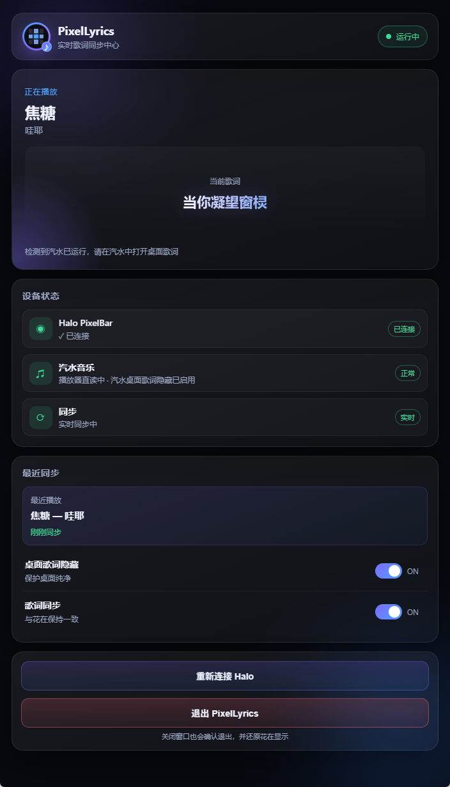

# PixelLyrics

在 Windows 上读取 **汽水音乐** 桌面歌词，通过本地桥接同步到 **EDIFIER Halo PixelBar（花再）** 的桌面歌词伴侣。

> 本项目为独立开源社区项目，**与** 汽水音乐 / EDIFIER **无官方关联**。请自行确认本机软件与硬件的使用合规性。



*Dashboard 实机界面：汽水直读中，Halo 已连接，歌词实时同步。*

## 适配设备

| 类别 | 适配项 | 说明 |
|---|---|---|
| **显示设备（已适配）** | EDIFIER Halo PixelBar（花再） | USB HID；VID `0x2D99` / PID `0xA106`，interface `4`，usage page `0xFF14`，usage `1` |
| **歌词来源（已适配）** | 汽水音乐（Windows 桌面版） | 需安装并**保持「桌面歌词」开启**；通过本地 asar 注入 + `127.0.0.1:19228` 直读，不 OCR |
| **系统** | Windows 10 / 11 x64 | 开发需 Node.js 20+ |
| **暂未适配** | 其他 EDIFIER 音箱 / PixelBar 版本 | 设备过滤刻意收紧，仅识别上述 VID/PID/接口组合 |
| **暂未适配** | LX Music / 网易云等其他播放器 | 当前生产路径只做汽水桌面歌词直读 + MediaSession 曲目信息 |

HID 写入与协议实现以本机已验证的 Halo PixelBar 为准；换用其他设备前请先确认协议兼容性。

## 功能

- 汽水音乐桌面歌词 **本地直读**（asar 注入 + `127.0.0.1:19228` 桥，不 OCR）
- Halo PixelBar **USB HID** 显示歌词；切歌显示「歌名 - 歌手」
- 长歌词通过 **software ticker 循环窗口** 显示：英文优先按完整单词推进，中文约 16 字、半角字符约 32 格；中英文混排按显示宽度分窗
- 深色 Dashboard UI、托盘常驻、退出时恢复花在显示模式
- Halo HID 断开后 **自动重连**（不退出应用）
- 可选：隐藏汽水桌面歌词视觉（直读与桥接保持运行）

## 环境要求

| 项 | 说明 |
|---|---|
| 系统 | Windows 10 / 11 |
| Node.js | 20+（开发） |
| 汽水音乐 | 已安装；**桌面歌词功能保持开启**（不要关闭该功能） |
| Halo | EDIFIER Halo PixelBar（花再），USB 数据线连接 |

详细设备型号与协议参数见上文「适配设备」。

## 快速开始

```powershell
cd app
npm ci

# Windows 控制台中文日志建议 UTF-8：
chcp 65001
$OutputEncoding = [Console]::OutputEncoding = [System.Text.UTF8Encoding]::new($false)

npm run start:utf8
# 或 npm.cmd run start:utf8
```

1. **自行**打开汽水音乐并打开 **桌面歌词**（应用不会自动启动汽水）  
2. 检测到汽水后，界面提示：「检测到汽水已运行，请在汽水中打开桌面歌词」  
3. 歌词应出现在 Halo 与应用 Dashboard  

### 首次安装注入（汽水 asar）

```powershell
# 完全退出汽水音乐后执行
npm.cmd run test:soda-bridge -- --reconnect
```

桥接 token 统一存放于 Electron userData 目录（与应用配置同级，不提交进仓库）。

### 退出与设备还原

| 操作 | 行为 |
|---|---|
| 点击窗口 **X** | 根据主界面的关闭设置退出、最小化到托盘或每次询问 |
| UI / 托盘 **退出 PixelLyrics** | 恢复接管前 Halo 模式（采集到的 scene；未知则回退时钟）并断开 HID |

## 构建与发布

```powershell
cd app
npm ci
npm run build
```

产物：`app/dist/PixelLyrics-Setup-<version>.exe`（NSIS 安装器）

原生模块（`node-hid`、`windows-media-sessions`）通过 `asarUnpack` 解包。

### GitHub Release

工作流：`.github/workflows/build.yml`（`windows-latest`）

```powershell
git tag v0.1.0
git push origin v0.1.0
```

tag 构建成功后，在 GitHub **Releases** 下载安装包。

## 目录结构

```text
app/                    Electron 应用（生产代码）
  src/main.js           主进程：托盘、生命周期、接线
  src/lyrics/           汽水桥 + asar 注入
  src/halo/             HID 协议 / 设备 / 显示策略 / ownership
  src/media/            MediaSession + 切歌状态
  src/pipeline/         歌词去重与事件
  src/ui/               Dashboard UI
  tests/                单元测试与诊断脚本
.github/workflows/      Windows 构建 CI
docs/                   架构与开源说明
refs/                   只读参考实现（非运行时依赖）
LICENSE                 MIT
```

## 架构（简图）

```text
汽水 desktopLyrics.asar（注入）
        ↓ HTTP 127.0.0.1:19228 + token
SodaLyricsDirectService
        ↓ { text, translation, hint, lineIndex? }
MediaSession → SongStateManager（切歌 / track-info）
        ↓
LyricPipeline（去重）→ DisplayStrategy → Halo HID
        ↓
Electron UI（lyric-updated / track-info）
```

详见 [docs/ARCHITECTURE.md](docs/ARCHITECTURE.md)。

## 测试

```powershell
cd app
npm.cmd run test:halo-packets
npm.cmd run test:display-strategy
npm.cmd run test:halo-reconnect
npm.cmd run test:halo-ownership
npm.cmd run test:song-state
npm.cmd run test:app-lifecycle
```

诊断：

```powershell
npm.cmd run test:soda-bridge -- --probe
npm.cmd run diagnose:track-switch
```

## 故障排查

| 现象 | 处理 |
|---|---|
| 控制台中文乱码 | `chcp 65001` 或 `npm run start:utf8` |
| `npm.ps1` 禁止运行 | 使用 `npm.cmd` |
| 无歌词 / 端口占用 | 结束占用 `19228` 的进程；确认汽水桌面歌词已打开 |
| 提示「直读组件未安装」 | 完全退出汽水后 `test:soda-bridge -- --reconnect` |
| 花在未连接 | 检查 USB 数据线；应用内会自动重连（约 2s 扫描） |
| 退出后仍显示歌词 | 使用窗口 X 确认退出或「退出 PixelLyrics」，不要强杀进程 |

更多见 [docs/TROUBLESHOOTING.md](docs/TROUBLESHOOTING.md)。

## 免责声明

- 非 EDIFIER / 汽水音乐官方项目；协议与注入仅用于本机已安装软件与自有设备。  
- 修改第三方 asar 存在升级失效风险；汽水升级后可能需重新安装注入。  
- 使用本软件即表示理解：HID 与本地桥接操作需在合法授权范围内进行。

## 开发工具

开发工具：ChatGPT（架构与任务规划）· Xiaomi MiMo（编码、调试与文档落地）

## License

MIT — 见 [LICENSE](LICENSE)。

第三方依赖（Electron、node-hid、windows-media-sessions 等）遵循其各自许可证。
